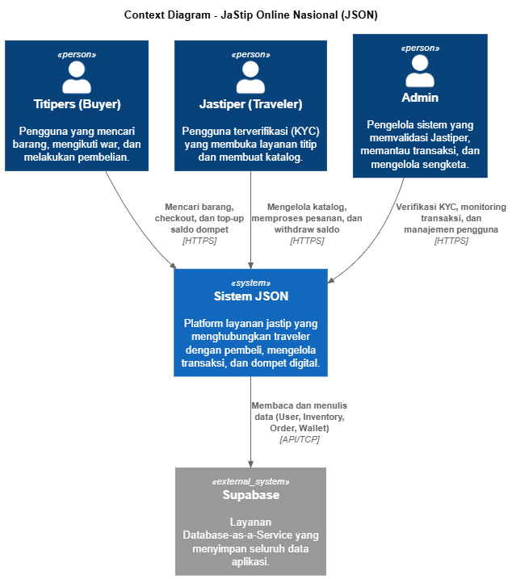
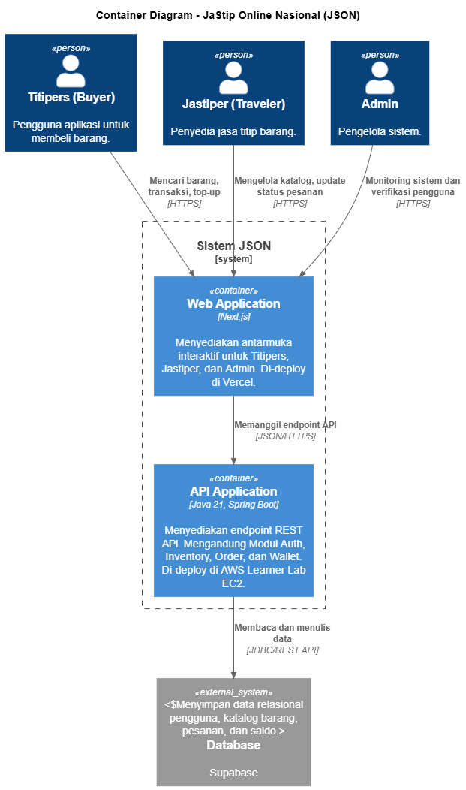
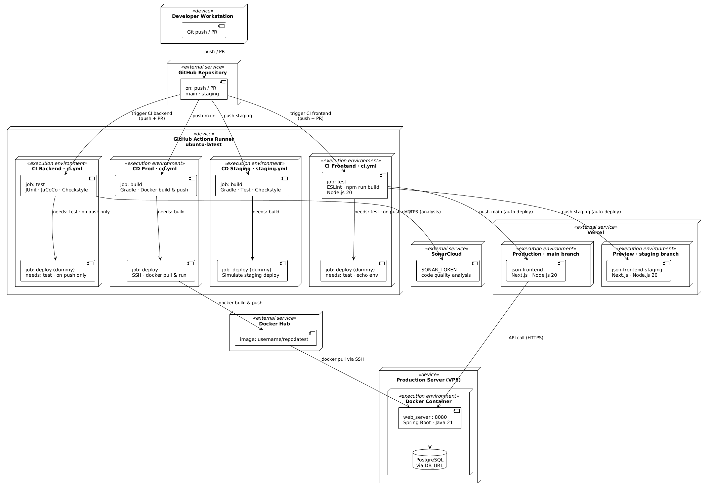
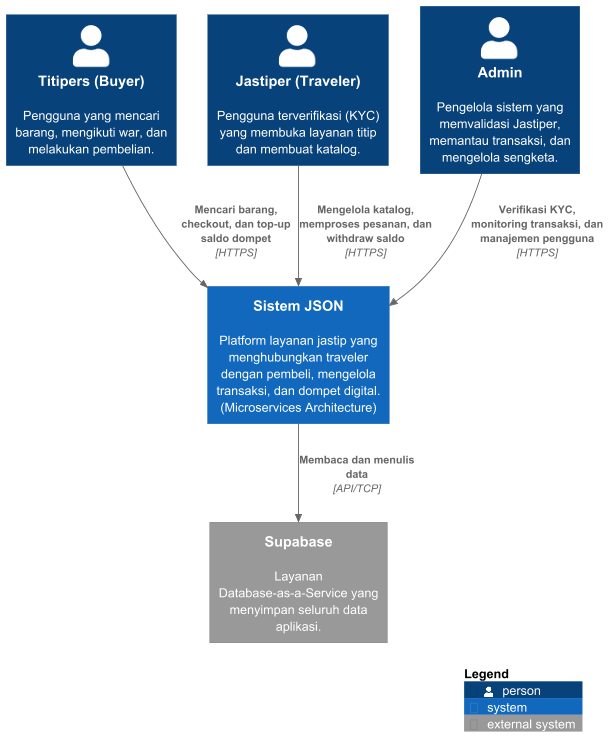
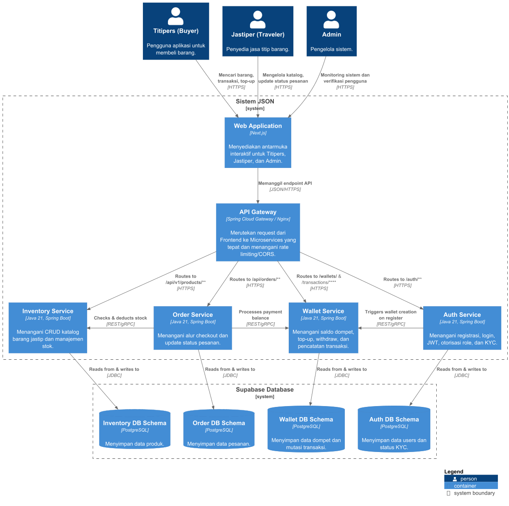
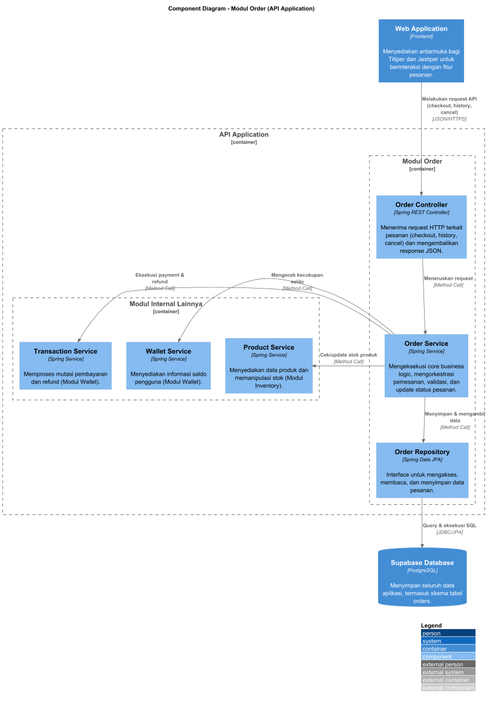
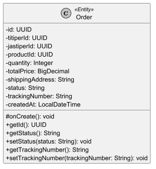
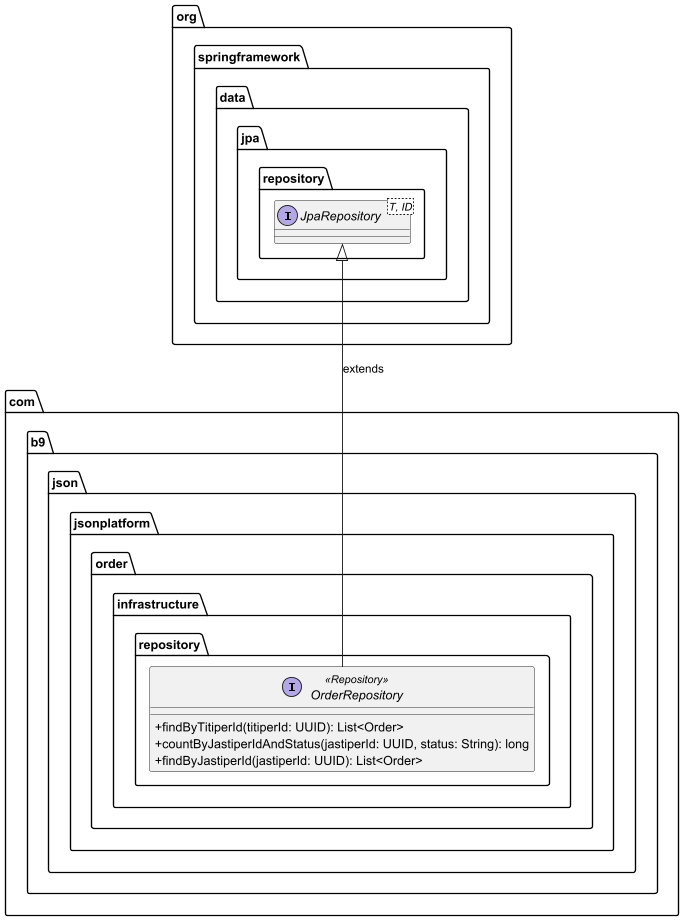
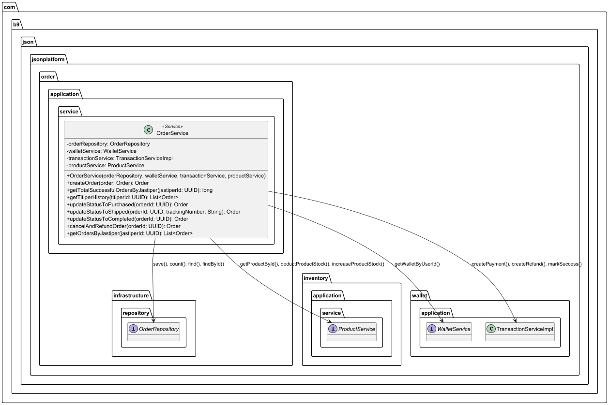
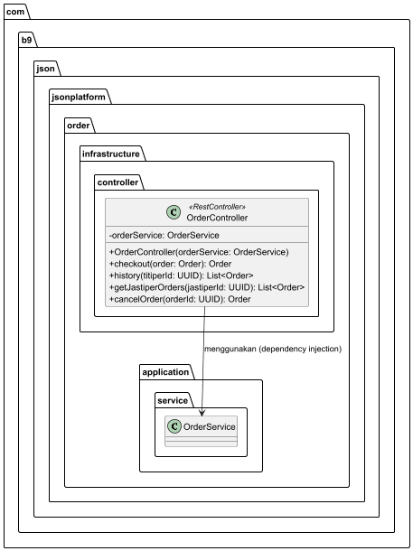

# 👥 Kelompok B-09

## 🔗 📋 Daftar Anggota

| NPM        | Nama                          |
|:-----------|:------------------------------|
| 2406495773 | Abigail Namaratonggi Pasaribu |
| 2406419663 | Azzahra Anjelika Borselano    |
| 2406421970 | Faris Huda                    |
| 2406409542 | Rafasya Muhammad Subhan       |

---

## Deliverable G.1: Current Architecture

* **Context Diagram**: 
* **Container Diagram**: 
* **Deployment Diagram**: 

## Deliverable G.2: Future Architecture

* **Future Context Diagram**: 
* **Future Container Diagram**: 

## Deliverable G.3: Risk Analysis and Architecture Modification Justification

Coba bayangkan kalau aplikasi JSON (JaStip Online Nasional) ini beneran sukses besar, 
misalnya lagi ada event "war" jastip barang limited edition atau tiket konser yang bikin traffic 
meledak tiba-tiba. Kalau kita masih mempertahankan arsitektur Monolithic seperti sekarang, 
ada beberapa risiko sistemik yang cukup bahaya.

Berdasarkan teknik Risk Storming yang kami lakukan, kami menemukan tiga risiko utama:

1. Titik Mati Tersentralisasi (Single Point of Failure): Saat ribuan orang rebutan checkout, 
beban di modul Order dan Wallet bakal sangat tinggi. Karena semua modul menyatu di 
satu server, modul lain seperti Auth (buat login) atau Inventory (katalog) bakal ikut 
nge-hang atau mati karena kehabisan RAM/CPU.

2. Database Bottleneck: Saat ini semua modul menembak ke satu database Supabase yang sama. 
Kalau proses write untuk pesanan dan potong saldo terjadi massal, database bisa mengalami table locking yang bikin seluruh aplikasi jadi super lemot.

3. Agility Deployment: Kalau ada bug kecil di fitur dompet dan kita mau update kodenya, 
kita terpaksa harus me-restart keseluruhan sistem, yang berarti bikin downtime buat semua user.

Kami menggunakan metode Risk Storming karena teknik ini ngebantu banget buat memvisualisasikan masalah secara kolaboratif. 
Dengan menaruh indikator risiko langsung di atas diagram arsitektur, kami jadi bisa melihat dengan jelas komponen mana 
yang paling rentan jadi bottleneck sebelum aplikasinya beneran down di production.

Untuk mengatasi risiko-risiko di atas, kami memutuskan untuk memodifikasi arsitektur menjadi Microservices. 
Dengan memecah aplikasi menjadi service yang independen (Auth, Inventory, Order, Wallet) dan memisahkan databasenya (database-per-service), kita bisa melakukan Independent Scalability.
Artinya, pas lagi war jastip, kita cukup scale up kapasitas server untuk Order Service dan Wallet Service saja tanpa membebani service lain. 
Selain itu, kami juga menambahkan API Gateway untuk merutekan traffic dengan lebih rapi. Arsitektur baru ini bikin sistem JSON 
jauh lebih tangguh (High Availability) dan siap menampung lonjakan user tanpa takut server crash massal.
## Deliverable Individual

### [Nama] - [NPM]
* **Component Diagram**: [Masukkan tautan/gambar Component Diagram individual]
* **Code Diagram**: [Masukkan tautan/gambar Code Diagram individual]

### Rafasya M. Subhan - 2406409542
* **Component Diagram**: 
* **Code Diagram**: 
### 1. Entity and Domain Model

### 2. Controller & DTO

### 3. Service Layer & Repository

### 4. Cross-Module Interactions

### Abigail Namaratonggi - 2406495773
* **Component Diagram**:
    * **Component Diagram - Modul Order (API Application)**
      
      *Diagram ini memetakan interaksi internal komponen pada Modul Order beserta integrasinya secara spesifik dengan Modul Inventory dan Wallet.*

* **Code Diagram**:
    * **1. Domain Layer (Order Entity)**
      
      *Diagram kelas untuk entitas Order yang merepresentasikan skema tabel di dalam database.*

    * **2. Repository Layer (Data Access)**
      
      *Diagram antarmuka OrderRepository yang mengelola kueri kustom ke database.*

    * **3. Service Layer (Business Logic)**
      
      *Diagram pusat logika bisnis yang menunjukkan orkestrasi pemesanan, validasi, pembayaran, pembatalan (refund), dan pembaruan stok lintas modul.*

    * **4. Controller Layer (REST API)**
      
      *Diagram titik masuk klien yang menangani permintaan HTTP dan meneruskannya ke lapisan layanan.*